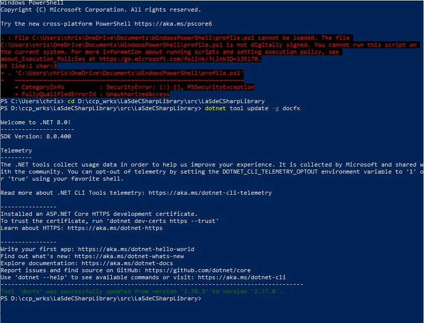
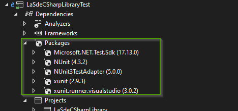
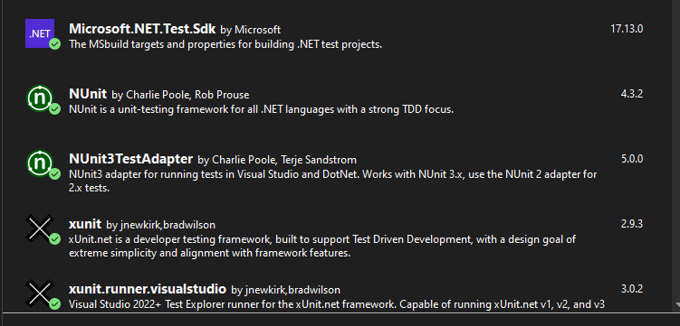
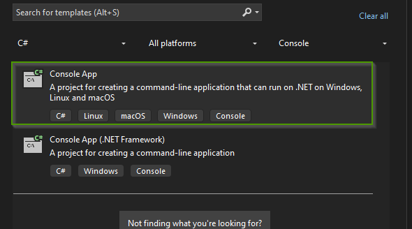
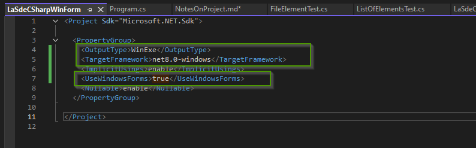
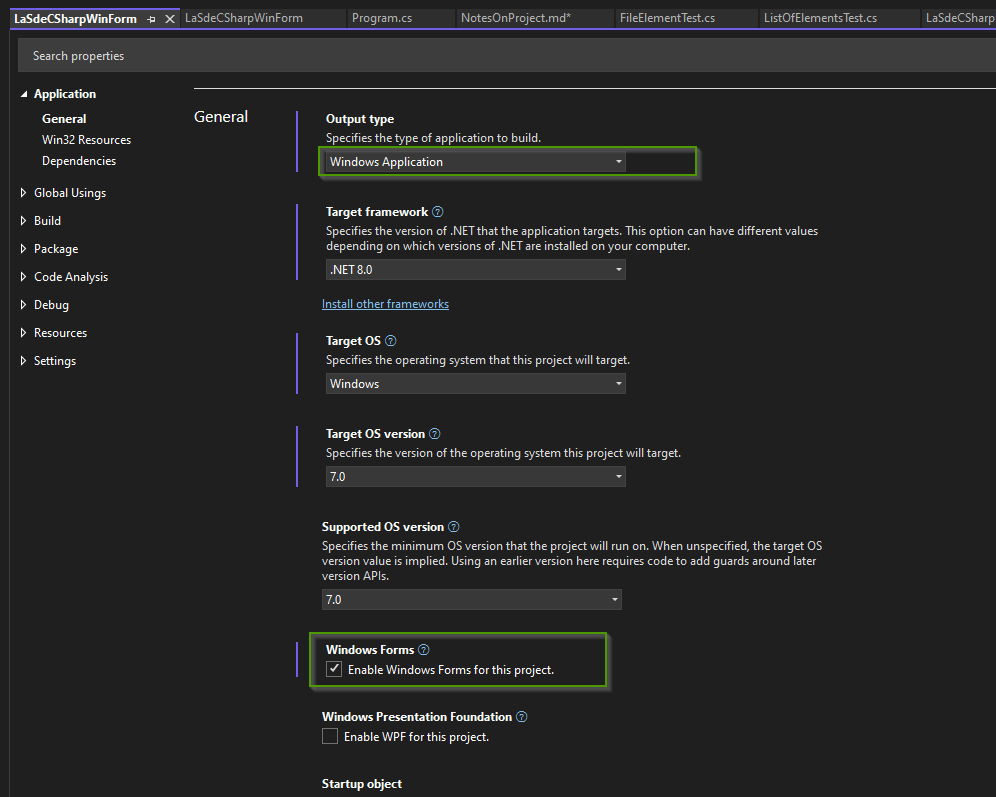
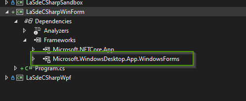
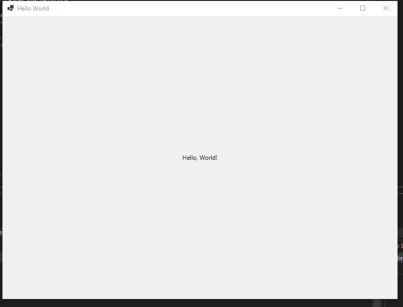

# Notes On Project

## Using DocFx documentation generator


### Useful links

[Microsoft Doc](https://microsoft.github.io/code-with-engineering-playbook/documentation/recipes/using-docfx-and-tools/)

[Github - repository](https://github.com/dotnet/docfx)

### Useful commands 

To update the tool

dotnet tool update -g docfx




## Unit testing using xUnit and nUnit

Packages installed




### Installed Nuget Packages




## Project installed

### WinForm project

* Create a Console C# Project



* Change *.csproject like this




* The project properties are now like this




* A new dependecy is automaticaly added to the project



### Minimal program test


* Source code (see src/ProgramWinForms.cs)

````csharp

using System.Windows.Forms;

namespace LaSdeCSharpWinForm
{
    internal class Program
    {
        static void Main(string[] args)
        {
           var form = new Form
           {
               Text = "Hello World",
               Width = 800,
               Height = 600
           };
            var label = new Label
            {
                Text = "Hello, World!",
                Dock = DockStyle.Fill,
                TextAlign = System.Drawing.ContentAlignment.MiddleCenter
            };
            form.Controls.Add(label);
            Application.Run(form);
        }
    }
}


````

* Form 

